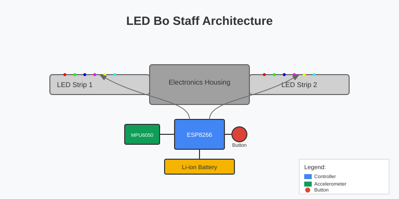
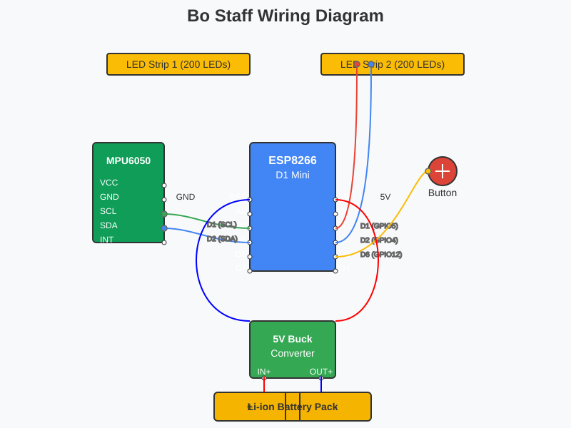
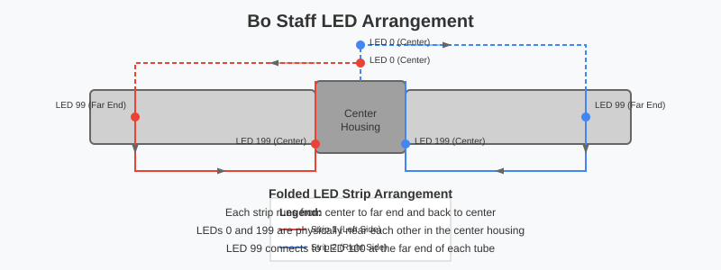

# LED Bo Staff Controller

<div align="center">
  
</div>

A specialized firmware for an LED bo staff, streamlined from WLED for optimal performance on battery-powered devices. This project focuses on creating an impressive light-based performance tool with dual-sensor impact detection capabilities.

## ✨ Features

- **Multiple LED Effects** optimized for a bo staff
- **Dual-Sensor Impact Detection** with MPU-6050 accelerometer and gyroscope
- **Impact Classification** distinguishes between stabbing and rotational impacts
- **Single Button Control** for cycling through effects
- **Mode Persistence** across power cycles
- **Battery-Optimized** for extended performance

## 🔌 Hardware

- ESP8266MOD D1mini microcontroller
- WS2812B or similar addressable LED strip (400 LEDs total in single strip)
- MPU-6050 accelerometer/gyroscope for dual-sensor impact detection
- Single button for mode cycling
- Battery-powered with Li-ion batteries

<div align="center">
  
</div>

### Pin Assignments

- **LED Strip**: D7 (GPIO13) - Single 400 LED strip
- **MPU-6050 I2C**: 
  - SDA: D2 (GPIO4) - Default I2C data pin
  - SCL: D1 (GPIO5) - Default I2C clock pin
- **Button**: D6 (GPIO12)

## 🖥️ Software Architecture

The project is structured in a modular fashion with the following key components:

- **LEDController**: Manages effects and LED updates with 4-segment folded strip logic
- **ButtonHandler**: Processes button inputs with debouncing
- **AccelerometerHandler**: Dual-sensor impact detection from the MPU-6050
- **SettingsManager**: Handles configuration persistence
- **PowerManager**: Battery monitoring and power-saving features

## 🔥 LED Effects

1. **Solid Color**: Displays a slowly changing solid color
2. **Fire Effect**: Realistic fire simulation (3 variants with different colors)
3. **Pulse Effect**: Waves propagating through the staff (3 variants)
4. **Rainbow Cycle**: Smooth color transitions
5. **Strobe Effect**: Rapid flashing effects

## 💥 Dual-Sensor Impact Detection

The system uses both accelerometer and gyroscope data for robust impact detection:

- **Accelerometer Threshold**: 75.0 m/s² (detects linear impacts)
- **Gyroscope Threshold**: 12.0 rad/s (detects rotational impacts)
- **Impact Classification**: 
  - **STAB**: Linear impacts with low rotation (< 6.3 rad/s)
  - **ROTATION**: Rotational impacts with high angular velocity (≥ 6.3 rad/s)

No calibration required - the system uses optimized fixed thresholds based on extensive testing.

<div align="center">
  
</div>

## 📐 LED Strip Configuration

The staff uses a single 400 LED strip arranged in 4 segments:
- **Segment 1**: LEDs 0-99 (counts up from base)
- **Segment 2**: LEDs 100-199 (counts down, folded back)
- **Segment 3**: LEDs 200-299 (counts up from center)
- **Segment 4**: LEDs 300-399 (counts down, folded back)

This folded arrangement allows for symmetrical effects across the staff.

## 📝 Documentation

- [Setup Guide](docs/setup.md): Detailed instructions for setting up the hardware and software
- [How to Build](docs/HOWTO.md): Step-by-step instructions for building your own LED bo staff
- [Design Notes](docs/design-notes.md): Technical decisions and architecture details
- [LED Arrangement](docs/led-arrangement.md): Details on the folded LED strip configuration
- [Pin Assignments](docs/pin-assignments.md): Details on GPIO pins used for each component

## 🛠️ Development Setup

This project uses PlatformIO for development. To get started:

1. Install [Visual Studio Code](https://code.visualstudio.com/)
2. Install the [PlatformIO extension](https://platformio.org/install/ide?install=vscode)
3. Clone this repository
4. Open the project in VS Code
5. Build and upload to your ESP8266

```bash
# Build the project
pio run

# Upload to ESP8266
pio run -t upload

# Monitor serial output
pio device monitor
```

## 📱 Physical Construction

The bo staff consists of:
- Two polycarbonate tubes (6 feet total length)
- Central aluminum housing for electronics
- 3D printed internal carrier for components
- 400 total LEDs arranged in a folded configuration (100 LEDs per segment)

## 🔄 Impact Detection Features

When an impact is detected:
- LED strip flashes bright blue-violet
- Impact type is classified as STAB or ROTATION
- Returns to the current effect after the flash
- Impact flash duration and fade effects are configurable
- 500ms cooldown prevents multiple triggers

## 👏 Credits

- Based on components from the [WLED project](https://github.com/Aircoookie/WLED)
- Uses the [FastLED library](https://github.com/FastLED/FastLED)
- Uses the [Adafruit MPU6050 library](https://github.com/adafruit/Adafruit_MPU6050)

## 📋 License

MIT License - Feel free to use and modify for your projects

---

<div align="center">
  Made with ❤️ for the LED performance art community
</div>
