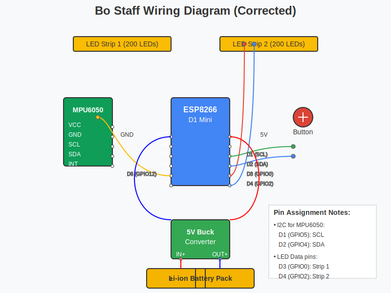

# LED Bo Staff Controller

<div align="center">
  
</div>

A specialized firmware for an LED bo staff, streamlined from WLED for optimal performance on battery-powered devices. This project focuses on creating an impressive light-based performance tool with impact detection capabilities.

## ✨ Features

- **Multiple LED Effects** optimized for a bo staff
- **Impact Detection** with MPU-6050 accelerometer
- **Single Button Control** for cycling through effects
- **Mode Persistence** across power cycles
- **Battery-Optimized** for extended performance

## 🔌 Hardware

- ESP8266MOD D1mini microcontroller
- WS2812B or similar addressable LED strips (400 LEDs total)
- MPU-6050 accelerometer for impact detection
- Single button for mode cycling
- Battery-powered with Li-ion batteries

<div align="center">
  
</div>

## 🖥️ Software Architecture

The project is structured in a modular fashion with the following key components:

- **LEDController**: Manages effects and LED updates
- **ButtonHandler**: Processes button inputs with debouncing
- **AccelerometerHandler**: Detects impacts from the MPU-6050
- **SettingsManager**: Handles configuration persistence

## 🔥 LED Effects

1. **Solid Color**: Displays a slowly changing solid color
2. **Fire Effect**: Realistic fire simulation
3. **Energy Pulse**: Waves propagating from the center
4. **Rainbow Cycle**: Smooth color transitions
5. **Strobe Effect**: Rapid flashing effects

## 📝 Documentation

- [Setup Guide](docs/setup.md): Detailed instructions for setting up the hardware and software
- [How to Build](docs/HOWTO.md): Step-by-step instructions for building your own LED bo staff
- [Design Notes](docs/design-notes.md): Technical decisions and architecture details

## 🛠️ Development Setup

This project uses PlatformIO for development. To get started:

1. Install [Visual Studio Code](https://code.visualstudio.com/)
2. Install the [PlatformIO extension](https://platformio.org/install/ide?install=vscode)
3. Clone this repository
4. Open the project in VS Code
5. Build and upload to your ESP8266

```bash
# Build the project
pio run

# Upload to ESP8266
pio run -t upload

# Monitor serial output
pio device monitor
```

## 📱 Physical Construction

The bo staff consists of:
- Two polycarbonate tubes (6 feet total length)
- Central aluminum housing for electronics
- 3D printed internal carrier for components
- 200 LEDs per section, with the LED strip routing up one side and down the other

## 🔄 Impact Detection

When an impact is detected:
- LED strips flash bright white
- Return to the current effect after the flash
- Impact threshold and flash duration are configurable

## 👏 Credits

- Based on components from the [WLED project](https://github.com/Aircoookie/WLED)
- Uses the [FastLED library](https://github.com/FastLED/FastLED)
- Uses the [Adafruit MPU6050 library](https://github.com/adafruit/Adafruit_MPU6050)

## 📋 License

MIT License - Feel free to use and modify for your projects

---

<div align="center">
  Made with ❤️ for the LED performance art community
</div>
