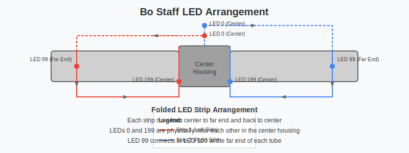

# LED Arrangement Details

## Overview

The LED Bo Staff uses a "folded" LED strip arrangement that is common in LED props. This arrangement allows for a single continuous strip to cover both sides of a tube while only needing one connection point at the center/hilt.

<div align="center">
  
</div>

## Folded Strip Configuration

In this arrangement, each LED strip (200 LEDs total) is organized as follows:

### Strip 1 (Left Side)
- **LED 0**: Located at the center/hilt
- **LEDs 1-98**: Run along the tube from center toward the far end
- **LED 99**: At the far end of the tube
- **LED 100**: Also at the far end (physically adjacent to LED 99)
- **LEDs 101-198**: Run back along the tube from the far end toward the center
- **LED 199**: Located at the center/hilt (physically adjacent to LED 0)

### Strip 2 (Right Side)
- **LED 0**: Located at the center/hilt
- **LEDs 1-98**: Run along the tube from center toward the far end
- **LED 99**: At the far end of the tube
- **LED 100**: Also at the far end (physically adjacent to LED 99)
- **LEDs 101-198**: Run back along the tube from the far end toward the center
- **LED 199**: Located at the center/hilt (physically adjacent to LED 0)

## Effect Considerations

This folded arrangement requires special handling in the effect code. For example:

1. **Distance-based effects**: When calculating effects based on physical position, we can't simply use the LED index. Instead, we need to calculate the distance from the center considering the folded nature of the strip.

2. **Pulse effects**: For pulse effects to emanate from the center, we need to calculate the physical position of each LED:
   - For LEDs 0-99: The distance from center = index
   - For LEDs 100-199: The distance from center = 199 - index

3. **Far-end effects**: To create effects at the far end of the staff, we target LEDs near indices 99 and 100.

## Code Implementation

The effect classes in this project account for the folded arrangement through the `isFolded` parameter. When `true`, calculations are adjusted to consider the physical arrangement of LEDs.

For example, in the `PulseEffect` class:

```cpp
// Calculate distance from center based on folded arrangement
uint8_t distanceFromCenter;

if (isFolded) {
  // In folded arrangement:
  // - LEDs 0 to midPoint-1 go from center to tip
  // - LEDs midPoint to numLeds-1 go from tip back to center
  if (i < midPoint) {
    distanceFromCenter = i; // First half: 0 is at center
  } else {
    distanceFromCenter = numLeds - 1 - i; // Second half: numLeds-1 is at center
  }
} else {
  // For standard linear arrangement
  distanceFromCenter = abs(i - midPoint);
}
```

## Hardware Assembly Notes

When assembling the LED strips:

1. Both strips must be routed up one side of the tube and back down the other side
2. The strip should be carefully bent at the far end to make the turn
3. Use a small piece of strip at the turn point if necessary
4. Make sure the data lines are properly connected at the center housing
5. Test the strips after installation to verify proper wiring before final assembly